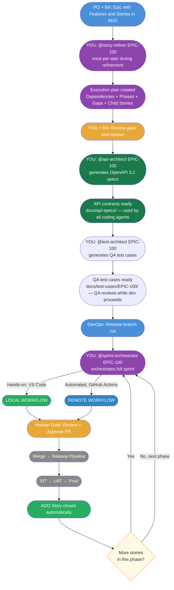
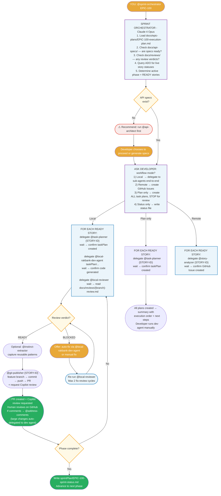
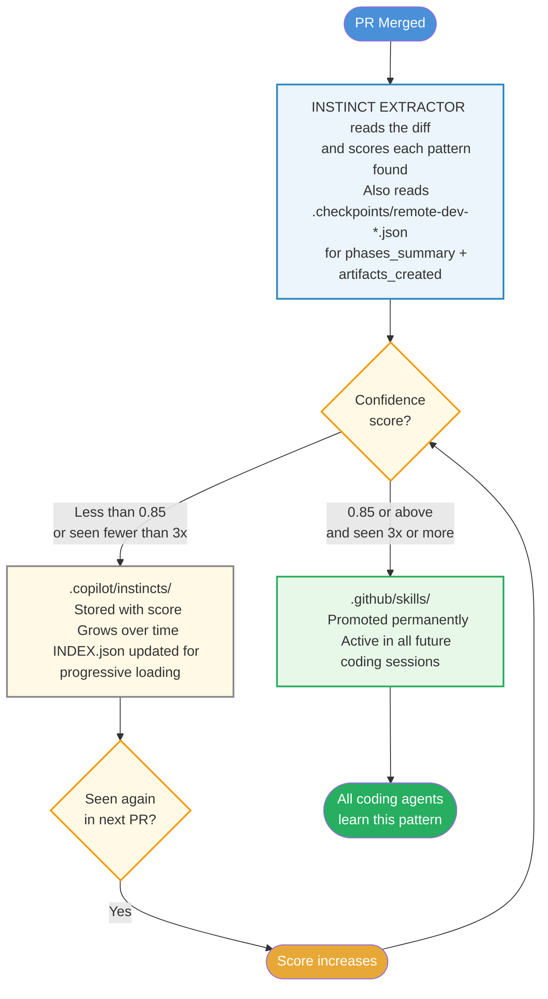

# Agentic SDLC — Development Cycle Flowchart

This document is the single source of truth for how development works on this project.
Feed this to GitHub Copilot agent at the start of any session to make it aware of the full cycle.

---

## Agent Architecture — Model Routing

| Agent | Model | Role | Trigger |
|-------|-------|------|---------|
| @story-refiner | Claude 4 Opus | Reads entire epic → dependency graph → execution plan → technical child stories | Manual: once per epic |
| @api-architect | Claude 4 Opus | Execution plan + solution design → OpenAPI 3.1 specs per service | Manual: after @story-refiner, before coding |
| @test-architect | Claude 4 Opus | ACs + API specs + business rules → QA test cases (functional, contract, integration, business rule) | Manual: after @api-architect, parallel with dev |
| @sprint-orchestrator | Claude 4 Opus | Reads execution plan → detects local/remote workflow → delegates to sub-agents → tracks progress | Manual: start of sprint |
| @story-analyzer | Claude 4 Opus | Reads ADO story + API spec → creates precise GitHub Issue | Manual: developer invokes |
| @task-planner | Claude 4 Opus | Reads ADO/task + API spec → creates local task plan | Manual: developer invokes |
| @local-reviewer | Claude 4 Opus | Pre-commit code review: mechanical-first + API contract compliance | Manual: developer invokes |
| @tech-debt-planner | Claude 4 Opus | Scans codebase for accumulated debt | Manual: every 2 sprints |
| @eval-runner | Claude 4 Opus | Evaluates agent outputs against golden references + scoring rubric | Manual: end of sprint |
| @rakbank-backend-dev-agent | Claude 4 Sonnet | Implements GitHub Issue spec → raises PR (follows API spec contract) | Automatic: `ai-generated` label |
| @local-rakbank-dev-agent | Claude 4 Sonnet | Implements task plan in VS Code (follows API spec contract) | Manual: developer invokes |
| @context-architect | Claude 4 Sonnet | Maps context & dependencies for changes | Manual: developer invokes |
| @git-publisher | Claude 4 Sonnet | Creates feature branch from release, commits reviewed code, pushes, raises PR | Manual: after @local-reviewer ✅ |
| @address-comments | Claude 4 Sonnet | Fixes PR review comments systematically | Automatic: `address-comments` label / manual |
| @instinct-extractor | Claude 4 Haiku | Extracts patterns from merged PRs | Automatic: PR merge |
| @local-instinct-learner | Claude 4 Haiku | Captures local session learnings into instinct library | Manual: developer invokes |
| @telemetry-collector | Claude 4 Haiku | Aggregates 7 data sources (telemetry, changelog, reviews, sessions, prompts, checkpoints, sprint plans) into comprehensive sprint summary | Manual: end of sprint |

**Model rationale:** Opus for decisions that shape all downstream work (planning, contract design, review, architecture, evaluation). Sonnet for code generation (best cost/quality ratio for implementation). Haiku for pattern matching and data aggregation (fast, cheap, doesn't need deep reasoning).

---

## Diagram 1 — Big Picture



---

## Diagram 2 — Story Refiner (Run Once Per Epic)

Run this BEFORE any sprint starts. It reads everything the BA wrote and translates it into an actionable technical plan.

```mermaid
flowchart TD
    A([YOU: @story-refiner EPIC-100]) --> B

    B["STORY REFINER - Claude 4 Opus
    1. Read Epic from ADO via MCP
    2. Read all Features (batch of 20 until done)
    3. For each Feature: read all child Stories (batch — no truncation)
    4. Read solution design docs + codebase state
    5. Map each story to a microservice
    Checkpoint: .checkpoints/story-refiner-EPIC-100.json"]

    B --> C["TECHNICAL ANALYSIS per story
    - Data model impact
    - API impact
    - State machine impact
    - Integration impact
    - Cross-service dependencies"]

    C --> D["BUILD DEPENDENCY GRAPH
    Entity deps: Story B needs entity from A
    API deps: Story B calls API from A
    State deps: Story B extends state from A
    Event deps: Story B listens to event from A"]

    D --> E["GENERATE EXECUTION PHASES
    Phase 1: Foundation stories (zero deps)
    Phase 2: Depends only on Phase 1
    Phase 3: Depends on Phase 1+2
    Within each phase: mark parallel tracks
    Mark contract handoffs between phases"]

    E --> F["DETECT GAPS
    Missing stories, ambiguous scope,
    contradictions, missing personas,
    circular dependencies"]

    F --> G["CREATE TECHNICAL CHILD STORIES IN ADO
    Full Description + Acceptance Criteria templates
    Service mapping, phase assignment
    Post-creation verification: re-read + patch if empty"]

    G --> H["OUTPUTS
    1. docs/epic-plans/EPIC-100-execution-plan.md
    2. Technical child stories in ADO (with Description + ACs)
    3. Gap report for BA review
    Checkpoint: status complete"]

    H --> I{Gaps found?}
    I -->|Yes| J([YOU + BA: Resolve gaps<br/>Re-run if needed])
    J --> A
    I -->|No| K([Run @api-architect EPIC-100<br/>Generate API contracts])

    style A fill:#E8A838,color:#fff
    style B fill:#EBF5FB,stroke:#2E86C1,stroke-width:2px
    style C fill:#EBF5FB,stroke:#2E86C1,stroke-width:2px
    style D fill:#EBF5FB,stroke:#2E86C1,stroke-width:2px
    style E fill:#EBF5FB,stroke:#2E86C1,stroke-width:2px
    style F fill:#EBF5FB,stroke:#2E86C1,stroke-width:2px
    style G fill:#EBF5FB,stroke:#2E86C1,stroke-width:2px
    style H fill:#EBF5FB,stroke:#2E86C1,stroke-width:2px
    style I fill:#FFF9E6,stroke:#F39C12,stroke-width:2px
    style J fill:#E8A838,color:#fff
    style K fill:#1A7A4A,color:#fff
```



---

## Diagram 2b — API Architect (Run After Story Refiner, Before Coding)

```mermaid
flowchart TD
    A([YOU: @api-architect EPIC-100]) --> B

    B["API ARCHITECT - Claude 4 Opus
    1. Read docs/epic-plans/EPIC-100-execution-plan.md
    2. Extract contract handoffs per phase
    3. Read docs/solution-design/ for personas + data model
    4. Identify services + their endpoints
    5. Search web for latest OpenAPI 3.1 best practices"]

    B --> C["GENERATE COMMON SCHEMAS
    docs/api-specs/common/schemas/errors.yaml
      → RFC 9457 ProblemDetail (type, title, status, detail, instance)
    docs/api-specs/common/schemas/pagination.yaml
      → Cursor-based pagination envelope
    docs/api-specs/common/schemas/audit.yaml
      → Standard audit fields (createdAt, updatedAt, createdBy)
    docs/api-specs/common/parameters/
    docs/api-specs/common/responses/"]

    C --> D["FOR EACH SERVICE — GENERATE SPEC
    docs/api-specs/{service-name}.yaml

    Best practices applied:
    - operationId on every operation
    - Read/write model separation (Request vs Response DTOs)
    - additionalProperties: false on all schemas
    - type: [string, 'null'] — no nullable keyword
    - Cursor pagination for all list endpoints
    - RFC 9457 errors for all 4xx/5xx
    - Examples on every schema and parameter
    - Security schemes (Bearer/API key)"]

    D --> E["QUALITY SELF-CHECK
    - Every operationId unique?
    - Every error response refs common/errors.yaml?
    - No nullable keyword used?
    - All $ref paths resolve correctly?
    - Read/write models separated?"]

    E --> F{Quality check<br/>passed?}
    F -->|Issues found| G([Fix spec → re-check])
    G --> E
    F -->|Clean| H["OUTPUT SUMMARY
    Services covered: {list}
    Operations generated: {count}
    Common schemas: {list}
    Spec files written to docs/api-specs/"]

    H --> I([Coding agents now have their contract<br/>Run @sprint-orchestrator to start stories])

    style A fill:#E8A838,color:#fff
    style B fill:#E8F8E8,stroke:#1A7A4A,stroke-width:2px
    style C fill:#E8F8E8,stroke:#1A7A4A,stroke-width:2px
    style D fill:#E8F8E8,stroke:#1A7A4A,stroke-width:2px
    style E fill:#E8F8E8,stroke:#1A7A4A,stroke-width:2px
    style F fill:#FFF9E6,stroke:#F39C12,stroke-width:2px
    style G fill:#E8A838,color:#fff
    style H fill:#E8F8E8,stroke:#1A7A4A,stroke-width:2px
    style I fill:#27AE60,color:#fff
```



---

## Diagram 3 — Local Workflow (VS Code)

Use this when you are at your desk and want full control over every step.
`@sprint-orchestrator` can run this entire flow automatically, or you can invoke each agent manually.

```mermaid
flowchart TD
    A([YOU: @task-planner STORY-456]) --> B

    B["TASK PLANNER - Claude 4 Opus
    1. Read ADO story via MCP
    2. Read solution design + changelog
    3. Load docs/api-specs/{service}.yaml (if exists)
       → extract operationId + schema refs for this story
    4. Grounded plan verification (codebase scan)
    5. Detect cross-service impact
    6. Generate context manifest (includes api-spec path)
    7. Write taskPlan/STORY-456-service.md"]

    B --> C{Gaps or\nclarifications?}
    C -->|Yes| D([YOU: Update ADO story\nRe-run planner])
    D --> A
    C -->|No| E

    E([YOU: @local-rakbank-dev-agent\ntaskPlan/STORY-456-service.md]) --> F

    F["LOCAL DEV AGENT - Claude 4 Sonnet
    Phase 0:   Load context + docs/api-specs/{service}.yaml
               API contract rule: method names = operationId
    Phase 0.5: Feasibility + checkpoint resume check
    Phase 1:   Bootstrap if new project
    Phase 2:   Pre-implementation analysis
    Phase 3:   Implement code (spec-compliant)
    Phase 4:   Tests
    Phase 5:   mvn compile + test + verify
    Phase 6:   Self-review checklist
    Checkpoint: .checkpoints/local-dev-STORY-456.json"]

    F --> G([YOU: @local-reviewer]) --> H

    H["LOCAL REVIEWER - Claude 4 Opus
    Step 1:  Load context incl. docs/api-specs/{service}.yaml
    Step 1.5: mvn compile         PASS or FAIL
             mvn test             PASS or FAIL
             mvn checkstyle       PASS or FAIL
             mvn verify           PASS or FAIL
    Step 2:  Critical checks:
             - BigDecimal, persona isolation, state machine
             - API contract compliance (operationId + schemas)
    Step 3:  Banking domain checks
    Step 4:  Write docs/reviews/{branch}-review.md
             (machine-parseable JSON + human-readable)"]

    H --> I{Verdict}
    I -->|BLOCKED| J([YOU: Fix issues\n@local-reviewer again])
    J --> G
    I -->|READY| K([YOU: git commit and push\nRaise PR])

    K --> L["LOCAL INSTINCT LEARNER - Haiku
    Optional: capture patterns
    from this session into .copilot/instincts/"]

    style A fill:#E8A838,color:#fff
    style B fill:#EBF5FB,stroke:#2E86C1,stroke-width:2px
    style C fill:#FFF9E6,stroke:#F39C12,stroke-width:2px
    style D fill:#E8A838,color:#fff
    style E fill:#E8A838,color:#fff
    style F fill:#EBF5FB,stroke:#2E86C1,stroke-width:2px
    style G fill:#E8A838,color:#fff
    style H fill:#EBF5FB,stroke:#2E86C1,stroke-width:2px
    style I fill:#FFF9E6,stroke:#F39C12,stroke-width:2px
    style J fill:#E8A838,color:#fff
    style K fill:#E8A838,color:#fff
    style L fill:#EBF5FB,stroke:#2E86C1,stroke-width:2px
```



---

## Diagram 3b — Sprint Orchestrator (Automated Local Workflow)

`@sprint-orchestrator` can drive the entire local workflow without you manually invoking each agent.



---

## Diagram 4 — Remote Workflow (GitHub Actions)

Use this for batch processing or when you want automation to handle the full implementation.

```mermaid
flowchart TD
    A([YOU: @story-analyzer STORY-456]) --> B

    B["STORY ANALYZER - Claude 4 Opus
    1. Read ADO story fields via MCP
    2. Read solution-design docs + contexts/
    3. Step 2a: Check docs/api-specs/{service}.yaml
       → extract operationId + request/response schema refs
       → flag discrepancies between ACs and spec
    4. Classify: service + personas + state transitions
    5. Detect cross-service impact
    6. Create GitHub Issue with API Spec Reference section"]

    B --> C{Clarifications\nneeded?}
    C -->|Yes| D([YOU: Update ADO story\nRe-run analyzer])
    D --> A
    C -->|No| E

    E["CODING AGENT - Claude 4 Sonnet
    Triggered by label: ai-generated
    Phase 0:  Load context + docs/api-specs/{service}.yaml
              Contract rule: method names = operationId
    Phase 1:  Checkout release branch + checkpoint check
    Phase 2:  Pre-implementation analysis
    Phase 3:  Implement: migration, entity, repo,
              service, controller (spec-compliant), tests
    Phase 4:  mvn verify - MAX 3 retries
    Phase 5:  Raise Draft PR
    Checkpoint: .checkpoints/remote-dev-STORY-456.json"]

    E --> F["AI REVIEW
    Auto-triggered on PR open
    Checks: BigDecimal, AC tests, API contract compliance,
    persona isolation, TBD stubs, missing timeouts"]

    E --> G["CI PIPELINE
    Maven build
    SonarCloud
    Deploy to DEV"]

    F --> H
    G --> H

    H["HUMAN GATE
    YOU review the code + AI comments"]

    H --> I{Issues?}
    I -->|Yes| J["ADDRESS COMMENTS - Claude 4 Sonnet
    1. Read all unresolved comments
    2. Categorize each comment
    3. Fix one by one
    4. mvn verify after all fixes
    5. Push to feature branch"]

    J --> H
    I -->|No| K([YOU: Approve and Merge PR])

    K --> L["INSTINCT EXTRACTOR - Claude 4 Haiku
    Auto-triggered on PR merge
    1. Extract patterns from diff
    2. Update project-changelog.md
    3. Score confidence
    4. Promote to .github/skills/ if score >= 0.85"]

    L --> M["RELEASE PIPELINE
    SIT -> UAT -> Prod"]

    M --> N["ADO SYNC
    Auto-triggered on push to main
    Story marked Done with commit link"]

    style A fill:#E8A838,color:#fff
    style B fill:#EBF5FB,stroke:#2E86C1,stroke-width:2px
    style C fill:#FFF9E6,stroke:#F39C12,stroke-width:2px
    style D fill:#E8A838,color:#fff
    style E fill:#EBF5FB,stroke:#2E86C1,stroke-width:2px
    style F fill:#EBF5FB,stroke:#2E86C1,stroke-width:2px
    style G fill:#F0F0F0,stroke:#888,stroke-width:2px
    style H fill:#FEF9E7,stroke:#F39C12,stroke-width:3px
    style I fill:#FFF9E6,stroke:#F39C12,stroke-width:2px
    style J fill:#EBF5FB,stroke:#2E86C1,stroke-width:2px
    style K fill:#E8A838,color:#fff
    style L fill:#EBF5FB,stroke:#2E86C1,stroke-width:2px
    style M fill:#F0F0F0,stroke:#888,stroke-width:2px
    style N fill:#EBF5FB,stroke:#2E86C1,stroke-width:2px
```



---

## Diagram 5 — How the Agent Gets Smarter

Every merged PR feeds the learning system. Confidence builds across stories.



**Accuracy over time:**

| Sprint | Accuracy | What Changed |
|--------|----------|--------------|
| Sprint 1 | ~62% | Agent learning your patterns |
| Sprint 2 | ~73% | First instincts promoted to skills |
| Sprint 3 | ~81% | Skills compounding |
| Sprint 4+ | ~87% | Review time drops from 40 min to 15 min |

---

## Two Workflows — When to Use Which

| Scenario | Workflow | Why |
|----------|----------|-----|
| **Standard story** | LOCAL | Full control, immediate feedback, iterative |
| **Batch mode (3+ stories)** | REMOTE | Automated pipeline, parallel execution |
| **Quick hotfix** | LOCAL | Fastest path to production |
| **New developer onboarding** | LOCAL | They see every step, learn the patterns |
| **Sprint crunch** | REMOTE | Agent handles while you review others |
| **Exploration** | LOCAL + @context-architect | Map codebase before changing it |

Both workflows converge at the **Human Gate** — your engineering judgment is always required before merge.

---

## Who Does What — Quick Reference

### Local Workflow

| Phase | Actor | Time |
|-------|-------|------|
| Generate API contracts | @api-architect (once per epic) | 5–10 min |
| Create task plan | @task-planner (you invoke) | 2–3 min |
| Generate code | @local-rakbank-dev-agent (you invoke) | 10–15 min |
| Pre-commit review | @local-reviewer (you invoke) | 3–5 min |
| Fix review issues | You — in chat with agent | 10–20 min |
| Capture learnings | @local-instinct-learner (optional) | 1–2 min |
| **Your total active time** | | **~25–45 min** |

### Remote Workflow

| Phase | Actor | Time |
|-------|-------|------|
| Generate API contracts | @api-architect (once per epic) | 5–10 min |
| Run story analyzer | @story-analyzer (you invoke) | 3–5 min |
| GitHub Issue created | Agent — automatic | Included above |
| Code generated | Coding agent — automatic | 10–15 min |
| AI review comments | Review agent — automatic | 3–5 min |
| CI pipeline | Existing — automatic | 5–10 min |
| **Human gate — review + approve** | **You — judgment** | **20–40 min** |
| Address comments | @address-comments — automatic/manual | 5–10 min |
| Learning agent | @instinct-extractor — automatic | 2–3 min |
| SIT / UAT / Prod | Existing process | Per your process |
| ADO story → Done | ADO sync — automatic | 1 min |

---

## Hardening — What Prevents Agentic Failures

| Problem | Solution | Where |
|---------|----------|-------|
| Tool call loops | MAX iteration limits per agent (3 retries) | All agents — Behavior Rules |
| Context bleed | Context Isolation — re-read from disk every time | All agents — Context Isolation |
| Context window saturation | Tiered Context Budget (Tier 1/2/3) + Context Manifest | @local-rakbank-dev-agent, @task-planner |
| Planner-executor mismatch | Grounded Plan Verification — verify files exist first | @task-planner — Step 3.5 |
| Reward hacking in review | Mechanical-first (compile/test/static BEFORE subjective) | @local-reviewer — Step 1.5 |
| Missing guardrails | Explicit MUST NOT boundaries on every agent | All agents — Boundaries |
| State drift | Living Task Plan with TODO/IN PROGRESS/DONE/BLOCKED | @local-rakbank-dev-agent |
| Tool schema hallucination | MCP tool usage documented with exact operations | mcp-tools.instructions.md |
| Wrong tool aliases | Official VS Code Copilot aliases enforced: `read`, `edit`, `search`, `execute`, `agent`, `web`, `todo` | All agent frontmatter |
| Wrong MCP server name | `microsoft/azure-devops-mcp` — must match VS Code registration exactly | All agent frontmatter, mcp-configs/ |
| Requirement drift | Project changelog — read before planning every story | @task-planner — Step 2.5 |
| Multi-repo confusion | Cross-service detection + one story per service | @task-planner, @story-analyzer |
| Liquibase collisions | Timestamp naming: YYYYMMDD-HHMM-ticket-desc.sql | cross-service.instructions.md |
| Accumulated debt | @tech-debt-planner scan every 2 sprints | @tech-debt-planner |
| No quality measurement | Evaluation framework with golden refs + scoring rubric | evals/, @eval-runner |
| No operational visibility | Agent telemetry — 7 sources aggregated: telemetry entries, changelog, reviews, session logs, prompt logs, checkpoints, sprint plans | docs/agent-telemetry/, @telemetry-collector |
| Manual story sequencing | Sprint orchestrator reads execution plan + presents parallel commands | @sprint-orchestrator |
| Agent output not machine-readable | JSON metadata blocks in issues, task plans, review reports | @story-analyzer, @task-planner, @local-reviewer |
| Instinct library bloat | INDEX.json for progressive disclosure — load only relevant instincts | .copilot/instincts/INDEX.json |
| Mid-run failure loses progress | Checkpoint files after each phase — resume from last success | .checkpoints/, all coding agents + @story-refiner |
| Checkpoint files deleted | Status lifecycle: in-progress → complete → never delete | .checkpoints/README.md — all 3 checkpoint agents |
| Story refiner truncates stories | Batch reading (batches of 20) until last batch < 20 — no hard cap | @story-refiner |
| Tech stories created without Description/ACs | Post-creation verification: read back + PATCH if empty | @story-refiner |
| API contract drift between planning and code | @api-architect generates authoritative spec; all agents follow it | @api-architect, @task-planner, @local-reviewer |
| Review report not referenceable by other agents | @local-reviewer writes docs/reviews/{branch}-review.md with machine-parseable JSON block | @local-reviewer, @sprint-orchestrator |
| Hooks not working on Windows | Node.js scripts (not bash+jq) — Node is always available in VS Code | .github/hooks/session-logger/ |
| Hooks format wrong | PascalCase event names, `command` key, `timeout` key in .github/hooks/*.json | .github/hooks/session-logger.json |
| QA test cases not independent of dev | @test-architect generates test cases; dev agents do NOT consume them — QA maintains independent validation | @test-architect |
| Test cases miss edge cases | Every AC gets positive + negative TC; every threshold gets boundary TC; every endpoint gets 400/401/404 | @test-architect |
| Requirement drift not visible to QA | @test-architect re-runs produce Delta sections showing added/modified/removed TCs | @test-architect, project-changelog |
| Agent-to-agent handoff loses instructions | Enriched handoff prompts with CRITICAL REMINDERS for context loading, bootstrap detection, instruction files | @sprint-orchestrator — Step 4 handoffs |
| Instruction files not loaded in agent chains | `agent-essentials.instructions.md` with `applyTo: '**'` — always injected regardless of file pattern | .github/instructions/agent-essentials.instructions.md |
| Dev agent skips bootstrap on empty repo | 🔴 MANDATORY pre-flight block at top of agent file + orchestrator passes REPO_STATE in handoff | @local-rakbank-dev-agent, @sprint-orchestrator |
| Full automation too risky for new teams | Plan Only mode — create all task plans then STOP for manual review before coding | @sprint-orchestrator — Mode 3 |
| PR comment fixes not pushed | @address-comments now commits + pushes fixes + replies on GitHub + requests Copilot re-review | @address-comments — Steps 4-7 |
| Large PR comments need dev agent | Comments requiring ≥50 lines changed auto-delegated to @local-rakbank-dev-agent via `agent` tool | @address-comments — Step 2.5 |
| No automated first-pass PR review | @git-publisher and @address-comments request GitHub Copilot as reviewer after push | @git-publisher Step 7.5, @address-comments Step 7 |

---

## The Three Loop Guards

The instinct extractor commits directly to the release branch — no PR raised.
Three guards prevent any infinite loop:

1. **Event type mismatch** — workflow triggers on `pull_request closed`, not `push`. Direct commits fire `push` only. Loop impossible by design.
2. **paths-ignore** — `.copilot/**` changes are ignored even if a PR were somehow raised.
3. **Commit message tag** — `[skip-learning]` in every learning commit as the final guard.

---

## File Structure Reference

```
.github/
├── agents/                              ← 17 agents as *.agent.md (correct VS Code path)
│   ├── story-refiner.agent.md           Epic → execution plan + technical tasks
│   ├── api-architect.agent.md           Execution plan → OpenAPI 3.1 specs
│   ├── test-architect.agent.md          ACs + API specs → QA test cases
│   ├── sprint-orchestrator.agent.md     Orchestrates sprint + delegates to sub-agents
│   ├── story-analyzer.agent.md          ADO story + API spec → GitHub Issue (remote)
│   ├── task-planner.agent.md            ADO/task + API spec → local task plan
│   ├── rakbank-backend-dev-agent.agent.md  Implements GitHub Issue (remote, spec-aware)
│   ├── local-rakbank-dev-agent.agent.md    Implements task plan (local, spec-aware)
│   ├── local-reviewer.agent.md          Pre-commit review + API contract compliance
│   ├── local-instinct-learner.agent.md  Learns from local sessions
│   ├── instinct-extractor.agent.md      Learns from merged PRs (remote)
│   ├── address-comments.agent.md        Fixes PR review comments
│   ├── context-architect.agent.md       Maps dependencies for changes
│   ├── tech-debt-planner.agent.md       Periodic codebase health scan
│   ├── git-publisher.agent.md           Feature branch → commit → push → PR
│   ├── eval-runner.agent.md             Evaluates agent output quality
│   └── telemetry-collector.agent.md     Aggregates 7-source sprint telemetry
├── instructions/
│   ├── coding.instructions.md           Java/Spring Boot standards
│   ├── review.instructions.md           Review checklist
│   ├── security.instructions.md         Security rules
│   ├── testing.instructions.md          Testing standards
│   ├── cross-service.instructions.md    Multi-repo rules
│   ├── mcp-tools.instructions.md        MCP tool usage rules
│   ├── middleware.instructions.md       Middleware/cross-cutting patterns
│   └── agent-essentials.instructions.md Always-on: context loading, banking rules, bootstrap detection
├── skills/
│   ├── context-map/SKILL.md             Context dependency mapping
│   ├── what-context-needed/SKILL.md     Smart context loading
│   ├── instinct-lookup/SKILL.md         Search institutional memory
│   └── refactor-plan/SKILL.md           Refactoring patterns
├── hooks/
│   ├── session-logger.json              ← Claude Code hooks config
│   │                                       Events: SessionStart, Stop, UserPromptSubmit
│   └── session-logger/                  ← Node.js scripts (Windows + macOS)
│       ├── log-session-start.js
│       ├── log-session-end.js
│       └── log-prompt.js                Logs agent name, prompt, char count, est. tokens
└── workflows/                           ← Hybrid mode only
    ├── 01-create-release-branch.yml
    ├── 02-story-to-issue.yml
    ├── 03-release.yml
    ├── 04-release-orchestrator.yml
    └── 05-instinct-extractor.yml

.copilot/instincts/                      Institutional memory (JSON files)
    └── INDEX.json                       Progressive disclosure index

.checkpoints/                            Agent checkpoint files (gitignored JSON)
    └── README.md                        Full lifecycle documentation (committed)

contexts/                                YOUR domain knowledge
docs/
├── solution-design/                     Architecture, personas, business rules
├── api-specs/                           API contracts (OpenAPI 3.1)  ← NEW
│   ├── common/
│   │   ├── schemas/errors.yaml          RFC 9457 ProblemDetail
│   │   ├── schemas/pagination.yaml      Cursor pagination envelope
│   │   ├── schemas/audit.yaml           Standard audit fields
│   │   ├── parameters/                  Shared query/header params
│   │   └── responses/                   Standard 4xx/5xx response refs
│   └── {service-name}.yaml              Per-service OpenAPI 3.1 spec
├── epic-plans/                          Execution plans from @story-refiner
├── test-cases/                          QA test cases from @test-architect
│   └── EPIC-{id}/                      Functional, API contract, integration, business rule tests
├── reviews/                             @local-reviewer structured reports
│   └── {branch-name}-review.md         Machine-parseable JSON + human-readable
├── agent-telemetry/                     Sprint-level operational metrics (7 sources)
│   ├── README.md
│   ├── TEMPLATE.md                      Sprint summary template (delivery, quality, efficiency, stability)
│   ├── current-sprint.md               Live telemetry entries (agents append here)
│   └── sprint-{N}-summary.md           Generated sprint summaries (archived)
├── ai-usage/                            Story-level audit trail (git hook)
├── issues/                              @story-analyzer local fallback drafts
└── project-changelog.md                 Requirement drift tracker

evals/                                   Agent evaluation framework
├── README.md
├── scoring-rubric.md                    4-dimension scoring criteria
├── sprint-tracker.md                    Sprint-over-sprint comparison
└── golden-references/                   Reference input/output pairs

taskPlan/                                Generated task plans (local workflow)
sprintPlan/                              Sprint status files
logs/copilot/                            Session logger output (gitignored)
```

---

## How to Start Any Copilot Session

Paste this at the start of any Copilot Chat session:

```
#file:docs/agentic-sdlc-flowchart.md

You are working on the {project-name} project.
Follow the agentic SDLC cycle defined in the file above.
We are on ADO story {id}. Begin with @task-planner.
```

Copilot will understand the full pipeline, its role in it, what comes before and after, and what the human gate expects of it.

---

## Agent Tool Aliases Reference

All agents use only the 7 official VS Code Copilot tool aliases in their `tools:` frontmatter:

| Alias | What it does |
|-------|-------------|
| `read` | Read files, directories, URLs |
| `edit` | Create and modify files |
| `search` | Search codebase, semantic search |
| `execute` | Run terminal commands, tests, builds |
| `agent` | Delegate tasks to sub-agents |
| `web` | Fetch content from the web |
| `todo` | Manage TODO items |

MCP server tools are referenced as `{server-name}/*`:
- `microsoft/azure-devops-mcp/*` — Azure DevOps work items, boards
- `github/*` — GitHub Issues, PRs, repos
