# Agentic SDLC — Development Cycle Flowchart

This document is the single source of truth for how development works on this project.
Feed this to GitHub Copilot agent at the start of any session to make it aware of the full cycle.

---

## Agent Architecture — Model Routing

| Agent | Model | Role | Trigger |
|-------|-------|------|---------|
| @story-analyzer | Claude 4 Opus | Reads ADO story → creates GitHub Issue | Manual: developer invokes |
| @task-planner | Claude 4 Opus | Reads ADO/task → creates local task plan | Manual: developer invokes |
| @rakbank-backend-dev-agent | Claude 4 Sonnet | Implements GitHub Issue spec → raises PR | Automatic: `ai-generated` label |
| @local-rakbank-dev-agent | Claude 4 Sonnet | Implements task plan in VS Code | Manual: developer invokes |
| @context-architect | Claude 4 Sonnet | Maps context & dependencies for changes | Manual: developer invokes |
| @address-comments | Claude 4 Sonnet | Fixes PR review comments systematically | Automatic: `address-comments` label / manual |
| @local-reviewer | Claude 4 Opus | Pre-commit code review (mechanical-first) | Manual: developer invokes |
| @instinct-extractor | Claude 4 Haiku | Extracts patterns from merged PRs | Automatic: PR merge |
| @local-instinct-learner | Claude 4 Haiku | Captures local session learnings | Manual: developer invokes |
| @tech-debt-planner | Claude 4 Opus | Scans codebase for accumulated debt | Manual: every 2 sprints |

**Model rationale:** Opus for decisions that shape all downstream work (planning, review, architecture). Sonnet for code generation (best cost/quality ratio for implementation). Haiku for pattern matching (fast, cheap, pattern extraction doesn't need deep reasoning).

---

## Complete Development Cycle

```mermaid
flowchart TD
    A([🧑 PO: Story created in ADO]) --> B

    B([🧑 DevOps: Release branch cut\nCreate Release Branch workflow\nrelease/feat-xyz]) --> C

    C([🧑 YOU: Open VS Code / Copilot Chat\nChoose LOCAL or REMOTE workflow])

    C -->|LOCAL workflow| LP
    C -->|REMOTE workflow| D1

    %% ============================================
    %% LOCAL WORKFLOW (VS Code)
    %% ============================================

    subgraph LOCALFLOW ["🖥️ LOCAL WORKFLOW — VS Code Agent Mode"]
        direction TB

        subgraph AGENT_TP ["⚙️ TASK PLANNER — Claude 4 Opus"]
            LP[🧑 YOU: @task-planner ADO-456]
            LP --> LP1[Reads ADO story via MCP]
            LP1 --> LP2[Reads solution design docs\n+ project changelog]
            LP2 --> LP3[Grounded Plan Verification\nVerifies files exist in codebase]
            LP3 --> LP4[Detects cross-service impact\nScope to ONE service]
            LP4 --> LP5[Generates Context Manifest\nTells dev agent exactly what to load]
            LP5 --> LP6[Creates taskPlan/ADO-456-service.md\nwith Living Task Plan statuses]
        end

        LP6 --> LPG{Gaps /\nclarifications?}
        LPG -->|Yes| LPFIX([🧑 YOU: Update ADO story\nClarify requirements\nRe-run planner])
        LPFIX --> LP
        LPG -->|No| LCA

        subgraph AGENT_LA ["⚙️ LOCAL DEV AGENT — Claude 4 Sonnet"]
            LCA[🧑 YOU: @local-coding-agent\ntaskPlan/ADO-456-service.md]
            LCA --> LCA0[Phase 0: Load Context Budget\nTier 1 always · Tier 2 per manifest\nTier 3 never]
            LCA0 --> LCA05[Phase 0.5: Plan Feasibility Check\nVerify files · branch freshness\nLiquibase numbering]
            LCA05 --> LCA1[Phase 1: Bootstrap if needed\nvia microservice-initializr]
            LCA1 --> LCA2[Phase 2: Pre-Implementation Analysis\nData model · API · Failure modes\nSecurity · Coupling]
            LCA2 --> LCA3[Phase 3: Implementation\nMigration → Entity → Repo →\nService → Controller → Tests]
            LCA3 --> LCA35[Update task plan status:\nTODO → IN PROGRESS → DONE]
            LCA35 --> LCA4[Phase 5: mvn compile → test →\ncheckstyle → pmd → verify]
            LCA4 --> LCA5[Phase 6: Self-Review Checklist\nPrincipal Engineer Standard]
        end

        LCA5 --> LRV

        subgraph AGENT_LR ["⚙️ LOCAL REVIEWER — Claude 4 Opus"]
            LRV[🧑 YOU: @local-reviewer]
            LRV --> LRV0[Step 1.5: Mechanical Verification\nmvn compile → test → checkstyle\n→ pmd → verify\nBINARY PASS/FAIL before review]
            LRV0 --> LRV1[Step 2: Review Checklist\n🔴 Critical · 🟡 Warning · 🟢 Suggestion]
            LRV1 --> LRV2[Step 3: Banking Domain Checks\nBigDecimal · Persona isolation\nState machine · SQL injection]
            LRV2 --> LRV3[Step 4: AC Coverage Check\nEvery AC → test method mapping]
            LRV3 --> LRV4{Verdict}
        end

        LRV4 -->|❌ BLOCKED| LRVFIX([🧑 YOU: Fix issues\n→ @local-reviewer again])
        LRVFIX --> LRV
        LRV4 -->|✅ READY| LCOMMIT

        LCOMMIT([🧑 YOU: git add · git commit\n→ push to feature branch\n→ raise PR])

        LCOMMIT --> LLEARN

        subgraph AGENT_LL ["⚙️ LOCAL INSTINCT LEARNER — Claude 4 Haiku"]
            LLEARN[🧑 YOU: @local-instinct-learner\nOptional: explicit learning]
            LLEARN --> LLEARN1[Analyze diff + session context]
            LLEARN1 --> LLEARN2[Create/reinforce instincts\nin .copilot/instincts/]
            LLEARN2 --> LLEARN3[Check promotion threshold\n→ promote to .github/skills/]
        end
    end

    LCOMMIT --> H1_MERGE
    LCOMMIT --> H2

    %% ============================================
    %% REMOTE WORKFLOW (GitHub Actions)
    %% ============================================

    subgraph REMOTEFLOW ["☁️ REMOTE WORKFLOW — GitHub Actions + Copilot Workspace"]
        direction TB

        subgraph AGENT1 ["⚙️ AGENT 1 — Story Analyzer — Claude 4 Opus"]
            D1[ADO MCP\nReads story fields individually]
            D2[GitHub MCP\nReads solution-design docs]
            D1 --> D3[Classifies service, personas,\nstate transitions, API contract,\ntest cases from ACs]
            D2 --> D3
            D3 --> D3A[Cross-Service Detection\nDecomposes multi-service stories]
            D3A --> D4[GitHub MCP\nCreates GitHub Issue\nLabels: ai-generated +\nservice-name + release branch]
        end

        D4 --> E{Clarifications\nneeded?}
        E -->|Yes| F([🧑 YOU: Update ADO story\nAnswer gaps\nRe-run analyzer])
        F --> D1
        E -->|No| G

        subgraph AGENT2 ["⚙️ AGENT 2 — Coding Agent — Claude 4 Sonnet"]
            G[Reads release branch\nfrom issue label]
            G --> G0[Context Isolation Protocol\nReads ONLY this issue\nNo cached knowledge]
            G0 --> G1[Checks out release/feat-xyz\nCreates feat/ADO-123-service]
            G1 --> G2[Copilot Workspace\nReads GitHub Issue spec\nReads coding-agent-bootstrap.md]
            G2 --> G3[Phase 2: Pre-Implementation Analysis\nData model · API · Failure modes]
            G3 --> G4[Phase 3: Implementation\nMigration → Entity → Repo →\nService → Controller → Tests]
            G4 --> G5[Phase 5: mvn verify\nMAX 3 fix cycles]
            G5 --> G6[Raises Draft PR\ntargeting release/feat-xyz]
        end

        G6 --> H1_REMOTE & H2
    end

    subgraph AGENT3 ["⚙️ AGENT 3 — AI Review (Automatic — triggered by PR opened)"]
        H1_REMOTE[Reads diff against\nreview-instructions.md]
        H1_MERGE[Reads diff against\nreview-instructions.md]
        H1_REMOTE --> H1A[Posts inline comments:\nBigDecimal violations\nMissing AC test methods\nPersona isolation gaps\nTBD integration code\nMissing timeouts]
        H1_MERGE --> H1A
    end

    subgraph EXISTINGCI ["⚙️ Existing CI — Release Orchestrator 04 (Automatic)"]
        H2[Maven build\nSonarCloud\nDeploy to DEV]
    end

    H1A --> I
    H2 --> I

    subgraph HUMANGATE ["🧑 HUMAN GATE — Your Engineering Judgment"]
        I[Review generated code +\nAI review comments]
        I --> I1{Business logic\ncorrect?}
        I1 -->|No| I2([Comment on PR\n@address-comments resolves])
        I2 --> AGENT_AC
        I1 -->|Yes| I3[AI review comments\naddressed?]
        I3 -->|No| AGENT_AC
        I3 -->|Yes| I5[mvn clean verify\npasses locally?]
        I5 -->|No| I4([Fix issues\nPush to feature branch])
        I4 --> H1_MERGE
        I5 -->|Yes| I6([Approve PR\nMerge into release/feat-xyz])
    end

    subgraph AGENT_AC ["⚙️ ADDRESS COMMENTS — Claude 4 Sonnet"]
        AC1[Reads all unresolved comments]
        AC1 --> AC2[Categorizes: code fix ·\nquestion · style · architecture]
        AC2 --> AC3[Makes targeted fixes\none comment at a time]
        AC3 --> AC4[mvn compile → test → verify]
        AC4 --> AC5[Pushes fixes to feature branch]
    end

    AGENT_AC --> H1_MERGE

    I6 --> J

    subgraph AGENT5 ["⚙️ AGENT 5 — Instinct Extractor — Claude 4 Haiku (Automatic — PR merge)"]
        J[Gets diff of merged PR\nSource files only]
        J --> J1[Extracts patterns\nfrom reviewed approved code\nScores confidence]
        J1 --> J15[Updates docs/project-changelog.md\nif entities/APIs/state machine changed]
        J15 --> J2{Confidence\nthreshold met?\n≥0.85 + seen 3×}
        J2 -->|Yes| J4[Promotes instinct\nto .github/skills/\nCoding agent learns permanently]
        J2 -->|No| J5[Stores in\n.copilot/instincts/\nBuilds confidence over time]
        J4 --> J6[Commits directly to\nrelease/feat-xyz\nno PR — no loop]
        J5 --> J6
        J6 --> J7[Posts summary on\nmerged PR]
    end

    J7 --> K

    subgraph RELEASE ["⚙️ Existing Release Pipeline"]
        K[release/feat-xyz]
        K --> K1[SIT\nQA Testing]
        K1 --> K2[UAT\nBusiness Acceptance]
        K2 --> K3[Pre-Prod\nFinal Checks]
        K3 --> K4[Prod\nGo Live]
        K4 --> K5[Push to main\n03 - Release workflow]
    end

    K5 --> L

    subgraph AGENT6 ["⚙️ AGENT 6 — ADO Sync (Automatic — push to main)"]
        L[Extracts ADO-123\nfrom commit message]
        L --> L1[ADO REST API\nStory → Done\nProduction commit linked]
        L1 --> L2[PO sees story closed\nwith production evidence]
    end

    L2 --> M([✅ Story Complete\nCode in Production\nADO Closed\nPattern Learned])

    %% ============================================
    %% PERIODIC: Tech Debt Planner
    %% ============================================

    subgraph PERIODIC ["🔄 PERIODIC — Every 2 Sprints"]
        TD([🧑 YOU: @tech-debt-planner])
        TD --> TD1[Scans: duplication · complexity\narchitecture drift · test health\ndependency health]
        TD1 --> TD2[Prioritized plan:\n🔴 P0 Fix Now\n🟡 P1 This Sprint\n🟢 P2 Next Sprint]
    end

    style A fill:#4A90D9,color:#fff
    style B fill:#4A90D9,color:#fff
    style C fill:#E8A838,color:#fff
    style F fill:#E8A838,color:#fff
    style I fill:#E8A838,color:#fff
    style I2 fill:#E8A838,color:#fff
    style I4 fill:#E8A838,color:#fff
    style I6 fill:#E8A838,color:#fff
    style LP fill:#E8A838,color:#fff
    style LCA fill:#E8A838,color:#fff
    style LRV fill:#E8A838,color:#fff
    style LCOMMIT fill:#E8A838,color:#fff
    style LLEARN fill:#E8A838,color:#fff
    style LPFIX fill:#E8A838,color:#fff
    style LRVFIX fill:#E8A838,color:#fff
    style TD fill:#E8A838,color:#fff
    style M fill:#27AE60,color:#fff
    style AGENT1 fill:#EBF5FB,stroke:#2E86C1
    style AGENT2 fill:#EBF5FB,stroke:#2E86C1
    style AGENT3 fill:#EBF5FB,stroke:#2E86C1
    style AGENT5 fill:#EBF5FB,stroke:#2E86C1
    style AGENT6 fill:#EBF5FB,stroke:#2E86C1
    style AGENT_TP fill:#EBF5FB,stroke:#2E86C1
    style AGENT_LA fill:#EBF5FB,stroke:#2E86C1
    style AGENT_LR fill:#EBF5FB,stroke:#2E86C1
    style AGENT_LL fill:#EBF5FB,stroke:#2E86C1
    style AGENT_AC fill:#EBF5FB,stroke:#2E86C1
    style HUMANGATE fill:#FEF9E7,stroke:#F39C12,stroke-width:3px
    style EXISTINGCI fill:#F0F0F0,stroke:#888
    style RELEASE fill:#F0F0F0,stroke:#888
    style LOCALFLOW fill:#F0FFF0,stroke:#27AE60,stroke-width:2px
    style REMOTEFLOW fill:#FFF0F0,stroke:#E74C3C,stroke-width:2px
    style PERIODIC fill:#F5F0FF,stroke:#8E44AD,stroke-width:2px
```



---

## Legend

| Colour | Meaning |
|--------|---------|
| 🔵 Blue | Human action — PO or DevOps |
| 🟡 Orange | Your action — developer |
| 🔵 Light blue box | AI agent — fully automatic |
| 🟡 Light yellow box | Human gate — your judgment required |
| 🟢 Light green box | Local workflow (VS Code) |
| 🔴 Light red box | Remote workflow (GitHub Actions) |
| 🟣 Light purple box | Periodic maintenance |
| ⬜ Grey box | Existing pipeline — unchanged |
| 🟢 Green | Done |

---

## Two Workflows — When to Use Which

| Scenario | Workflow | Why |
|----------|----------|-----|
| **Standard story implementation** | LOCAL | Full control, immediate feedback, iterative |
| **Batch story processing (3+ stories)** | REMOTE | Automated pipeline, parallel execution |
| **Quick fix / hotfix** | LOCAL | Fastest path to production |
| **New developer onboarding** | LOCAL | They see every step, learn the patterns |
| **Sprint crunch (many stories)** | REMOTE | Agent handles multiple stories while you review |
| **Exploration / prototyping** | LOCAL + @context-architect | Map the codebase before changing it |

Both workflows converge at the **Human Gate** — your engineering judgment is always required before merge.

---

## Who Does What — Quick Reference

### Local Workflow

| Phase | Actor | Time |
|-------|-------|------|
| Create task plan | @task-planner (you invoke) | 2–3 min |
| Generate code | @local-rakbank-dev-agent (you invoke) | 10–15 min |
| Pre-commit review | @local-reviewer (you invoke) | 3–5 min |
| Fix review issues | **You — in chat with agent** | 10–20 min |
| Capture learnings | @local-instinct-learner (optional) | 1–2 min |
| **Your total active time** | | **~25–45 min** |

### Remote Workflow

| Phase | Actor | Time |
|-------|-------|------|
| Run story analyzer | @story-analyzer (you invoke) | 3–5 min |
| GitHub Issue created | Agent 1 — automatic | Included above |
| Code generated | Agent 2 — automatic | 10–15 min |
| AI review comments | Agent 3 — automatic | 3–5 min |
| CI pipeline | Existing — automatic | 5–10 min |
| **Human gate — review + approve** | **You — judgment** | **20–40 min** |
| Address comments | @address-comments — automatic/manual | 5–10 min |
| Learning agent | @instinct-extractor — automatic | 2–3 min |
| SIT / UAT / Prod | Existing process | Per your process |
| ADO story → Done | Agent 6 — automatic | 1 min |

---

## How the Agent Gets Smarter

Every merged PR feeds the learning system. Confidence builds across stories.

```
Story 1–2   →  Instincts created (confidence 0.60–0.75)
Story 3–4   →  Instincts reinforced → promoted to skills (confidence 0.85+)
Story 5–8   →  Skills active in coding agent → accuracy improves
Story 10+   →  Agent generates code that looks like your team wrote it
```

### Two Learning Channels

```
LOCAL:  Session → @local-instinct-learner → .copilot/instincts/ (origin: "local")
REMOTE: PR merge → @instinct-extractor → .copilot/instincts/ (origin: "remote")

Both channels feed the same instinct store.
Both contribute to the same promotion threshold.
```

### Accuracy Progression

```
Sprint 1:  ~60–65%  — agent learning your patterns
Sprint 2:  ~70–75%  — first instincts promoted to skills
Sprint 3:  ~78–82%  — skills compounding
Sprint 4+: ~85–88%  — human gate review drops from 40 min to 15 min
```

---

## Hardening — What Prevents Agentic Failures

| Problem | Solution | Where Implemented |
|---------|----------|-------------------|
| **Tool call loops** | MAX iteration limits per agent (3 mvn cycles, 3 retries) | All agent files — "Agent Behavior Rules" |
| **Context bleed** | Context Isolation Protocol — re-read from disk, no cached knowledge | All agent files — "Context Isolation" |
| **Context window saturation** | Tiered Context Budget (Tier 1/2/3) + Context Manifest in task plans | @local-rakbank-dev-agent, @task-planner |
| **Planner-executor mismatch** | Grounded Plan Verification — verify files exist before planning | @task-planner — Step 3.5 |
| **Observation truncation** | Targeted file reads, specific section references, not whole docs | @task-planner Context Manifest |
| **Reward hacking in review** | Mechanical-first verification (compile/test/static BEFORE subjective) | @local-reviewer — Step 1.5 |
| **Missing guardrails** | Explicit "MUST NOT" boundaries on every agent | All agent files — "Boundaries" |
| **State drift in long sessions** | Living Task Plan with TODO/IN PROGRESS/DONE/BLOCKED/SKIPPED | @local-rakbank-dev-agent |
| **Tool schema hallucination** | MCP tool usage instructions with exact operations documented | mcp-tools.instructions.md |
| **No retry logic** | Retry ONCE on network errors, STOP on auth errors, MAX 3 per tool | All agent files — "Error Handling" |
| **Orchestrator bottleneck** | Two independent workflows (local/remote), no central coordinator | Architecture choice |
| **Requirement drift** | Project changelog — append-only, read before planning | @task-planner — Step 2.5, @instinct-extractor — Step 3.5 |
| **Multi-repo confusion** | Cross-service detection + one-story-per-service decomposition | @task-planner, @story-analyzer, cross-service.instructions.md |
| **Agent code homogeneity** | @tech-debt-planner scans for accumulated mediocrity every 2 sprints | @tech-debt-planner |
| **Liquibase collisions** | Timestamp-based naming: `{YYYYMMDD}-{HHMM}-{ticket-id}-{desc}.sql` | cross-service.instructions.md, @task-planner |

---

## The Three Loop Guards (Agent 5)

Agent 5 commits directly to the release branch — no PR raised.
This is intentional. Three guards prevent any infinite loop:

1. **Event type mismatch** — workflow triggers on `pull_request closed`, not `push`. Direct commits fire `push` only. Loop impossible.
2. **paths-ignore** — `.copilot/**` changes ignored even if a PR was somehow raised.
3. **Commit message tag** — `[skip-learning]` in every learning commit as final guard.

---

## File Structure Reference

```
.github/
├── copilot/
│   └── agents/
│       ├── story-analyzer.md          ← ADO → GitHub Issue (remote)
│       ├── task-planner.md            ← ADO/task → local task plan
│       ├── rakbank-backend-dev-agent.md ← Implements GitHub Issue (remote)
│       ├── local-rakbank-dev-agent.md ← Implements task plan (local)
│       ├── context-architect.md       ← Maps dependencies for changes
│       ├── address-comments.md        ← Fixes PR review comments
│       ├── local-reviewer.md          ← Pre-commit code review
│       ├── instinct-extractor.md      ← Learns from merged PRs (remote)
│       ├── local-instinct-learner.md  ← Learns from local sessions
│       └── tech-debt-planner.md       ← Periodic codebase health scan
├── instructions/
│   ├── coding.instructions.md         ← Java/Spring Boot standards
│   ├── review.instructions.md         ← Review checklist
│   ├── security.instructions.md       ← Security rules
│   ├── testing.instructions.md        ← Testing standards
│   ├── cross-service.instructions.md  ← Multi-repo rules
│   └── mcp-tools.instructions.md      ← MCP tool usage rules
├── skills/
│   ├── bootstrap-rakbank-microservice/ ← Project scaffolding skill
│   ├── instinct-lookup/               ← Search institutional memory
│   └── refactor-plan/                 ← Refactoring patterns
└── workflows/
    ├── 01-create-release-branch.yml
    ├── 02-story-to-issue.yml
    ├── 03-release.yml
    ├── 04-release-orchestrator.yml
    └── 05-instinct-extractor.yml

.copilot/
└── instincts/                          ← Institutional memory (JSON files)
    ├── coding-{name}.json
    ├── testing-{name}.json
    ├── security-{name}.json
    ├── integration-{name}.json
    └── domain-{name}.json

contexts/
└── banking.md                          ← Domain context

docs/
├── solution-design/
│   ├── architecture-overview.md        ← State machines, system design
│   ├── user-personas.md                ← Access rules per role
│   ├── business-rules.md               ← Business logic constraints
│   ├── integration-map.md              ← External system contracts
│   └── data-model.md                   ← Entity relationships
├── project-changelog.md                ← Requirement drift tracker
├── agent-feedback/
│   └── TEMPLATE.md                     ← Post-story feedback form
└── ai-usage/                           ← AI usage audit trail

taskPlan/                                ← Generated task plans (local workflow)
```

---

## How to Feed This to Your Copilot Agent

At the start of any Copilot Chat session, reference this file:

```
#file:docs/agentic-sdlc-flowchart.md

You are working on the mortgage-ipa project.
Follow the agentic SDLC cycle defined in the file above.
We are on ADO story {id}. Begin with @task-planner.
```

Copilot will understand the full pipeline, its role in it, what comes before and after, and what the human gate expects of it.
