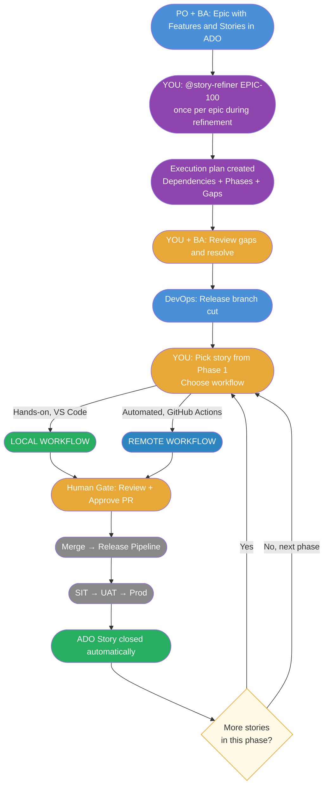
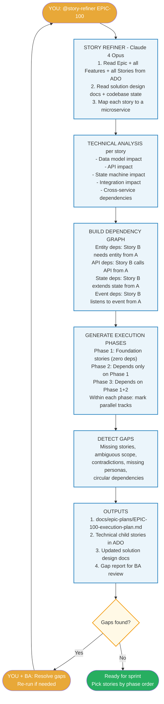
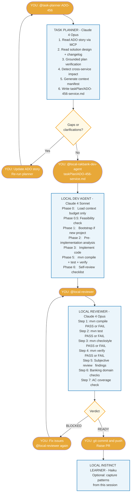
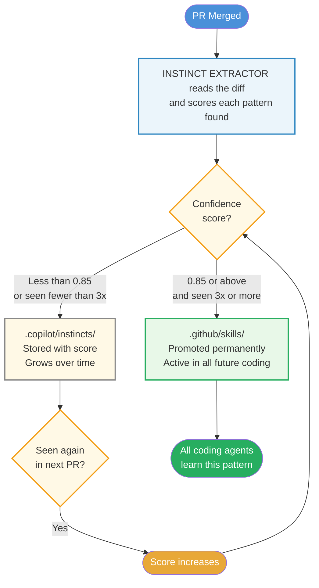

# Agentic SDLC — Development Cycle Flowchart

This document is the single source of truth for how development works on this project.
Feed this to GitHub Copilot agent at the start of any session to make it aware of the full cycle.

---

## Agent Architecture — Model Routing

| Agent | Model | Role | Trigger |
|-------|-------|------|---------|
| @story-refiner | Claude 4 Opus | Reads entire epic → dependency graph → execution plan | Manual: once per epic |
| @story-analyzer | Claude 4 Opus | Reads ADO story → creates GitHub Issue | Manual: developer invokes |
| @task-planner | Claude 4 Opus | Reads ADO/task → creates local task plan | Manual: developer invokes |
| @rakbank-backend-dev-agent | Claude 4 Sonnet | Implements GitHub Issue spec → raises PR | Automatic: `ai-generated` label |
| @local-rakbank-dev-agent | Claude 4 Sonnet | Implements task plan in VS Code | Manual: developer invokes |
| @context-architect | Claude 4 Sonnet | Maps context & dependencies for changes | Manual: developer invokes |
| @address-comments | Claude 4 Sonnet | Fixes PR review comments systematically | Automatic: `address-comments` label / manual |
| @local-reviewer | Claude 4 Opus | Pre-commit code review (mechanical-first) | Manual: developer invokes |
| @instinct-extractor | Claude 4 Haiku | Extracts patterns from merged PRs | Automatic: PR merge |
| @local-instinct-learner | Claude 4 Haiku | Captures local session learnings | Manual: developer invokes |
| @tech-debt-planner | Claude 4 Opus | Scans codebase for accumulated debt | Manual: every 2 sprints |

**Model rationale:** Opus for decisions that shape all downstream work (planning, review, architecture). Sonnet for code generation (best cost/quality ratio for implementation). Haiku for pattern matching (fast, cheap, pattern extraction doesn't need deep reasoning).

---

## Diagram 1 — Big Picture



---

## Diagram 2 — Story Refiner (Run Once Per Epic)

Run this BEFORE any sprint starts. It reads everything the BA wrote and translates it into an actionable technical plan.



---

## Diagram 3 — Local Workflow (VS Code)

Use this when you are at your desk and want full control over every step.



---

## Diagram 4 — Remote Workflow (GitHub Actions)

Use this for batch processing or when you want automation to handle the full implementation.

```mermaid
flowchart TD
    A([YOU: @story-analyzer ADO-456]) --> B

    B["STORY ANALYZER - Claude 4 Opus
    1. Read ADO story fields via MCP
    2. Read solution-design docs
    3. Classify: service + personas + state transitions
    4. Detect cross-service impact
    5. Create GitHub Issue with labels"]

    B --> C{Clarifications\nneeded?}
    C -->|Yes| D([YOU: Update ADO story\nRe-run analyzer])
    D --> A
    C -->|No| E

    E["CODING AGENT - Claude 4 Sonnet
    Triggered by label: ai-generated
    1. Context isolation protocol
    2. Checkout release branch
    3. Pre-implementation analysis
    4. Implement: migration, entity, repo,
       service, controller, tests
    5. mvn verify - MAX 3 retries
    6. Raise Draft PR"]

    E --> F["AI REVIEW - Agent 3
    Auto-triggered on PR open
    Checks: BigDecimal, AC tests,
    persona isolation, TBD stubs,
    missing timeouts"]

    E --> G["CI PIPELINE
    Maven build
    SonarCloud
    Deploy to DEV"]

    F --> H
    G --> H

    H["HUMAN GATE
    YOU review the code + AI comments"]

    H --> I{Issues?}
    I -->|Yes| J["ADDRESS COMMENTS - Claude 4 Sonnet
    1. Read all unresolved comments
    2. Categorize each comment
    3. Fix one by one
    4. mvn verify after all fixes
    5. Push to feature branch"]

    J --> H
    I -->|No| K([YOU: Approve and Merge PR])

    K --> L["INSTINCT EXTRACTOR - Claude 4 Haiku
    Auto-triggered on PR merge
    1. Extract patterns from diff
    2. Update project-changelog.md
    3. Score confidence
    4. Promote to skills if score >= 0.85"]

    L --> M["RELEASE PIPELINE
    SIT -> UAT -> Prod"]

    M --> N["ADO SYNC - Agent 6
    Auto-triggered on push to main
    Story marked Done with commit link"]

    style A fill:#E8A838,color:#fff
    style B fill:#EBF5FB,stroke:#2E86C1,stroke-width:2px
    style C fill:#FFF9E6,stroke:#F39C12,stroke-width:2px
    style D fill:#E8A838,color:#fff
    style E fill:#EBF5FB,stroke:#2E86C1,stroke-width:2px
    style F fill:#EBF5FB,stroke:#2E86C1,stroke-width:2px
    style G fill:#F0F0F0,stroke:#888,stroke-width:2px
    style H fill:#FEF9E7,stroke:#F39C12,stroke-width:3px
    style I fill:#FFF9E6,stroke:#F39C12,stroke-width:2px
    style J fill:#EBF5FB,stroke:#2E86C1,stroke-width:2px
    style K fill:#E8A838,color:#fff
    style L fill:#EBF5FB,stroke:#2E86C1,stroke-width:2px
    style M fill:#F0F0F0,stroke:#888,stroke-width:2px
    style N fill:#EBF5FB,stroke:#2E86C1,stroke-width:2px
```



---

## Diagram 5 — How the Agent Gets Smarter

Every merged PR feeds the learning system. Confidence builds across stories.



**Accuracy over time:**

| Sprint | Accuracy | What Changed |
|--------|----------|--------------|
| Sprint 1 | ~62% | Agent learning your patterns |
| Sprint 2 | ~73% | First instincts promoted to skills |
| Sprint 3 | ~81% | Skills compounding |
| Sprint 4+ | ~87% | Review time drops from 40 min to 15 min |

---

## Two Workflows — When to Use Which

| Scenario | Workflow | Why |
|----------|----------|-----|
| **Standard story** | LOCAL | Full control, immediate feedback, iterative |
| **Batch mode (3+ stories)** | REMOTE | Automated pipeline, parallel execution |
| **Quick hotfix** | LOCAL | Fastest path to production |
| **New developer onboarding** | LOCAL | They see every step, learn the patterns |
| **Sprint crunch** | REMOTE | Agent handles while you review others |
| **Exploration** | LOCAL + @context-architect | Map codebase before changing it |

Both workflows converge at the **Human Gate** — your engineering judgment is always required before merge.

---

## Who Does What — Quick Reference

### Local Workflow

| Phase | Actor | Time |
|-------|-------|------|
| Create task plan | @task-planner (you invoke) | 2–3 min |
| Generate code | @local-rakbank-dev-agent (you invoke) | 10–15 min |
| Pre-commit review | @local-reviewer (you invoke) | 3–5 min |
| Fix review issues | You — in chat with agent | 10–20 min |
| Capture learnings | @local-instinct-learner (optional) | 1–2 min |
| **Your total active time** | | **~25–45 min** |

### Remote Workflow

| Phase | Actor | Time |
|-------|-------|------|
| Run story analyzer | @story-analyzer (you invoke) | 3–5 min |
| GitHub Issue created | Agent 1 — automatic | Included above |
| Code generated | Agent 2 — automatic | 10–15 min |
| AI review comments | Agent 3 — automatic | 3–5 min |
| CI pipeline | Existing — automatic | 5–10 min |
| **Human gate — review + approve** | **You — judgment** | **20–40 min** |
| Address comments | @address-comments — automatic/manual | 5–10 min |
| Learning agent | @instinct-extractor — automatic | 2–3 min |
| SIT / UAT / Prod | Existing process | Per your process |
| ADO story → Done | Agent 6 — automatic | 1 min |

---

## Hardening — What Prevents Agentic Failures

| Problem | Solution | Where |
|---------|----------|-------|
| Tool call loops | MAX iteration limits per agent (3 retries) | All agents — Behavior Rules |
| Context bleed | Context Isolation — re-read from disk every time | All agents — Context Isolation |
| Context window saturation | Tiered Context Budget (Tier 1/2/3) + Context Manifest | @local-rakbank-dev-agent, @task-planner |
| Planner-executor mismatch | Grounded Plan Verification — verify files exist first | @task-planner — Step 3.5 |
| Reward hacking in review | Mechanical-first (compile/test/static BEFORE subjective) | @local-reviewer — Step 1.5 |
| Missing guardrails | Explicit MUST NOT boundaries on every agent | All agents — Boundaries |
| State drift | Living Task Plan with TODO/IN PROGRESS/DONE/BLOCKED | @local-rakbank-dev-agent |
| Tool schema hallucination | MCP tool usage documented with exact operations | mcp-tools.instructions.md |
| Requirement drift | Project changelog — read before planning every story | @task-planner — Step 2.5 |
| Multi-repo confusion | Cross-service detection + one story per service | @task-planner, @story-analyzer |
| Liquibase collisions | Timestamp naming: YYYYMMDD-HHMM-ticket-desc.sql | cross-service.instructions.md |
| Accumulated debt | @tech-debt-planner scan every 2 sprints | @tech-debt-planner |

---

## The Three Loop Guards

The instinct extractor commits directly to the release branch — no PR raised.
Three guards prevent any infinite loop:

1. **Event type mismatch** — workflow triggers on `pull_request closed`, not `push`. Direct commits fire `push` only. Loop impossible by design.
2. **paths-ignore** — `.copilot/**` changes are ignored even if a PR were somehow raised.
3. **Commit message tag** — `[skip-learning]` in every learning commit as the final guard.

---

## File Structure Reference

```
.github/
├── copilot/agents/
│   ├── story-refiner.md            Epic → dependency graph → execution plan
│   ├── story-analyzer.md           ADO story → GitHub Issue (remote)
│   ├── task-planner.md             ADO/task → local task plan
│   ├── rakbank-backend-dev-agent.md  Implements GitHub Issue (remote)
│   ├── local-rakbank-dev-agent.md  Implements task plan (local)
│   ├── context-architect.md        Maps dependencies for changes
│   ├── address-comments.md         Fixes PR review comments
│   ├── local-reviewer.md           Pre-commit code review
│   ├── instinct-extractor.md       Learns from merged PRs (remote)
│   ├── local-instinct-learner.md   Learns from local sessions
│   └── tech-debt-planner.md        Periodic codebase health scan
├── instructions/
│   ├── coding.instructions.md      Java/Spring Boot standards
│   ├── review.instructions.md      Review checklist
│   ├── security.instructions.md    Security rules
│   ├── testing.instructions.md     Testing standards
│   ├── cross-service.instructions.md  Multi-repo rules
│   └── mcp-tools.instructions.md   MCP tool usage rules
├── skills/
│   ├── bootstrap-rakbank-microservice/  Project scaffolding
│   ├── instinct-lookup/             Search institutional memory
│   └── refactor-plan/               Refactoring patterns
└── workflows/
    ├── 01-create-release-branch.yml
    ├── 02-story-to-issue.yml
    ├── 03-release.yml
    ├── 04-release-orchestrator.yml
    └── 05-instinct-extractor.yml

.copilot/instincts/                  Institutional memory (JSON files)

contexts/banking.md                  Domain context

docs/
├── solution-design/                 Architecture, personas, business rules
├── epic-plans/                      Execution plans from @story-refiner
├── project-changelog.md             Requirement drift tracker
└── agent-feedback/TEMPLATE.md       Post-story feedback form

taskPlan/                            Generated task plans (local workflow)
```

---

## How to Start Any Copilot Session

Paste this at the start of any Copilot Chat session:

```
#file:docs/agentic-sdlc-flowchart.md

You are working on the mortgage-ipa project.
Follow the agentic SDLC cycle defined in the file above.
We are on ADO story {id}. Begin with @task-planner.
```

Copilot will understand the full pipeline, its role in it, what comes before and after, and what the human gate expects of it.
