# Agentic SDLC — Development Cycle Flowchart

This document is the single source of truth for how development works on this project.
Feed this to GitHub Copilot agent at the start of any session to make it aware of the full cycle.

---

## Complete Development Cycle

```mermaid
flowchart TD
    A([🧑 PO: Story created in ADO]) --> B

    B([🧑 DevOps: Release branch cut\nCreate Release Branch workflow\nrelease/feat-xyz]) --> C

    C([🧑 YOU: Open VSCode\nCopilot Chat — Agent Mode\nPaste story-analyzer.md with ADO story ID])

    C --> D1
    C --> D2

    subgraph AGENT1 ["⚙️ AGENT 1 — Story Analyzer (Automatic)"]
        D1[ADO MCP\nReads story, ACs, priority]
        D2[GitHub MCP\nReads solution-design docs]
        D1 --> D3[Claude Opus 4.6\nClassifies service, personas,\nstate transitions, API contract,\ntest cases from ACs]
        D2 --> D3
        D3 --> D4[GitHub MCP\nCreates GitHub Issue\nLabels: ai-generated +\napplication-service +\nrelease/feat-xyz]
    end

    D4 --> E{Clarifications\nneeded?}
    E -->|Yes| F([🧑 YOU: Update ADO story\nAnswer gaps\nRe-run analyzer])
    F --> C
    E -->|No| G

    subgraph AGENT2 ["⚙️ AGENT 2 — Coding Agent (Automatic — triggered by ai-generated label)"]
        G[Reads release branch\nfrom issue label]
        G --> G1[Checks out release/feat-xyz\nCreates feat/ADO-123-service]
        G1 --> G2[Copilot Workspace\nReads GitHub Issue spec\nReads coding-agent-bootstrap.md]
        G2 --> G3[Generates:\nFlyway migration\nJPA Entity + Enums\nRepository\nService + State machine\nController + OpenAPI\nUnit tests per AC\nIntegration tests]
        G3 --> G4[Raises Draft PR\ntargeting release/feat-xyz\nLinks back to ADO story]
    end

    G4 --> H1 & H2

    subgraph AGENT3 ["⚙️ AGENT 3 — AI Review (Automatic — triggered by PR opened)"]
        H1[Reads diff against\nreview-instructions.md]
        H1 --> H1A[Posts inline comments:\nBigDecimal violations\nMissing AC test methods\nPersona isolation gaps\nTBD integration code\nMissing timeouts]
    end

    subgraph EXISTINGCI ["⚙️ Existing CI — Release Orchestrator 04 (Automatic)"]
        H2[Maven build\nSonarCloud\nDeploy to DEV]
    end

    H1A --> I
    H2 --> I

    subgraph HUMANGATE ["🧑 HUMAN GATE — Your Engineering Judgment"]
        I[Review generated code]
        I --> I1{Business logic\ncorrect?}
        I1 -->|No| I2([Comment on PR\nAgent re-runs with correction])
        I2 --> G2
        I1 -->|Yes| I3[AI review comments\naddressed?]
        I3 -->|No| I4([Fix issues\nPush to feature branch])
        I4 --> H1
        I3 -->|Yes| I5[mvn clean verify\npasses locally?]
        I5 -->|No| I4
        I5 -->|Yes| I6([Approve PR\nMerge into release/feat-xyz])
    end

    I6 --> J

    subgraph AGENT5 ["⚙️ AGENT 5 — Learning Agent (Automatic — triggered by PR merge into release/*)"]
        J[Gets diff of merged PR\nSource files only]
        J --> J1[GitHub Models API\nClaude Opus 4.6\nCopilot Enterprise — no extra billing]
        J1 --> J2[Extracts patterns\nfrom reviewed approved code\nScores confidence]
        J2 --> J3{Confidence\nthreshold met?\n≥0.85 + seen 3x}
        J3 -->|Yes| J4[Promotes instinct\nto .copilot/skills/\nCoding agent learns permanently]
        J3 -->|No| J5[Stores in\n.copilot/instincts/\nBuilds confidence over time]
        J4 --> J6[Commits directly to\nrelease/feat-xyz\nno PR — no loop]
        J5 --> J6
        J6 --> J7[Posts summary on\nmerged PR]
    end

    J7 --> K

    subgraph RELEASE ["⚙️ Existing Release Pipeline"]
        K[release/feat-xyz]
        K --> K1[SIT\nQA Testing]
        K1 --> K2[UAT\nBusiness Acceptance]
        K2 --> K3[Pre-Prod\nFinal Checks]
        K3 --> K4[Prod\nGo Live]
        K4 --> K5[Push to main\n03 - Release workflow]
    end

    K5 --> L

    subgraph AGENT6 ["⚙️ AGENT 6 — ADO Sync (Automatic — triggered by push to main)"]
        L[Extracts ADO-123\nfrom commit message]
        L --> L1[ADO REST API\nStory → Done\nProduction commit linked]
        L1 --> L2[PO sees story closed\nwith production evidence]
    end

    L2 --> M([✅ Story Complete\nCode in Production\nADO Closed\nPattern Learned])

    style A fill:#4A90D9,color:#fff
    style B fill:#4A90D9,color:#fff
    style C fill:#E8A838,color:#fff
    style F fill:#E8A838,color:#fff
    style I fill:#E8A838,color:#fff
    style I2 fill:#E8A838,color:#fff
    style I4 fill:#E8A838,color:#fff
    style I6 fill:#E8A838,color:#fff
    style M fill:#27AE60,color:#fff
    style AGENT1 fill:#EBF5FB,stroke:#2E86C1
    style AGENT2 fill:#EBF5FB,stroke:#2E86C1
    style AGENT3 fill:#EBF5FB,stroke:#2E86C1
    style AGENT5 fill:#EBF5FB,stroke:#2E86C1
    style AGENT6 fill:#EBF5FB,stroke:#2E86C1
    style HUMANGATE fill:#FEF9E7,stroke:#F39C12,stroke-width:3px
    style EXISTINGCI fill:#F0F0F0,stroke:#888
    style RELEASE fill:#F0F0F0,stroke:#888
```



---

## Legend

| Colour | Meaning |
|--------|---------|
| 🔵 Blue | Human action — PO or DevOps |
| 🟡 Orange | Your action — developer |
| 🔵 Light blue box | AI agent — fully automatic |
| 🟡 Light yellow box | Human gate — your judgment required |
| ⬜ Grey box | Existing pipeline — unchanged |
| 🟢 Green | Done |

---

## Who Does What — Quick Reference

| Phase | Actor | Time |
|-------|-------|------|
| Story created in ADO | PO | Already done |
| Release branch cut | DevOps / Dev | Already done |
| Run story analyzer | **You** — 1 line in Copilot Chat | 2 min |
| GitHub Issue created | Agent 1 — automatic | 3–5 min |
| Code generated | Agent 2 — automatic | 10–15 min |
| AI review comments | Agent 3 — automatic | 3–5 min |
| CI pipeline | Existing — automatic | 5–10 min |
| **Human gate — review + approve** | **You — judgment** | **20–40 min** |
| Learning agent | Agent 5 — automatic | 2–3 min |
| SIT / UAT / Prod | Existing process | Per your process |
| ADO story → Done | Agent 6 — automatic | 1 min |

**Your total active time per story: ~25–45 minutes.**

---

## How the Agent Gets Smarter

Every merged PR feeds the learning agent. Confidence builds across stories.

```
Story 1–2   →  Instincts created (confidence 0.60–0.75)
Story 3–4   →  Instincts reinforced → promoted to skills (confidence 0.85+)
Story 5–8   →  Skills active in coding agent → accuracy improves
Story 10+   →  Agent generates code that looks like your team wrote it
```

Accuracy progression:
```
Sprint 1:  ~60–65%  — agent learning your patterns
Sprint 2:  ~70–75%  — first instincts promoted to skills
Sprint 3:  ~78–82%  — skills compounding
Sprint 4+: ~85–88%  — human gate review drops from 40 min to 15 min
```

---

## The Three Loop Guards (Agent 5)

Agent 5 commits directly to the release branch — no PR raised.
This is intentional. Three guards prevent any infinite loop:

1. **Event type mismatch** — workflow triggers on `pull_request closed`, not `push`. Direct commits fire `push` only. Loop impossible.
2. **paths-ignore** — `.copilot/**` changes ignored even if a PR was somehow raised.
3. **Commit message tag** — `[skip-learning]` in every learning commit as final guard.

---

## How to Feed This to Your Copilot Agent

At the start of any Copilot Chat session, reference this file:

```
#file:docs/agentic-sdlc-flowchart.md

You are working on the mortgage-ipa project. 
Follow the agentic SDLC cycle defined in the file above.
We are on ADO story {id}. Begin Phase 3.
```

Copilot will understand the full pipeline, its role in it, what comes before and after, and what the human gate expects of it.
